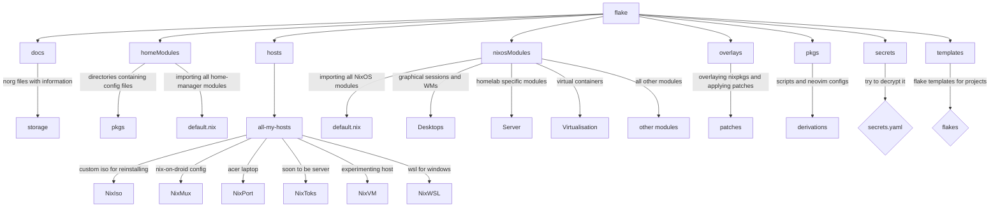

# What is this?
This is my multi host, modular Nix config. It declares configs for different programs using Nix language, such as:
- Neovim module to use [Rocks.nvim](https://github.com/nvim-neorocks/rocks.nvim) on NixOS with [my lua config](https://github.com/Ladas552/nvim-rocks-config)
- [Helix](https://github.com/helix-editor/helix) - Master branch with a use of official [Helix flake cache](https://app.cachix.org/cache/helix)
- [Niri](https://github.com/YaLTeR/niri) - Scrollable Tilling Wayland Compositor via Community [Niri-flake](https://github.com/sodiboo/niri-flake)
- And many more with [Home-manager](https://github.com/nix-community/home-manager), that allows to declare configuration of user programs in Nix language

I also declare configuration as packages that you can try with `nix run
github:Ladas552/Nix-Is-Unbreakable#app`, replace `app` with:

- [nvf](https://github.com/NotAShelf/nvf) - Nix declared Neovim
- [nixvim](https://github.com/nix-community/nixvim) - another Nix declared Neovim
- rofi-powermenu - power menu made of Rofi with a [nice theme](https://github.com/adi1090x/rofi)
- all the other scripts in [pkgs directory](./pkgs/default.nix)

# Overview of things to note

## Hosts

- 2 NixOS hosts with Nvidia and Intel, and AMD APU on laptops. Both on ZFS and NixPort is using [Impermanence](https://github.com/nix-community/impermanence)
- [Nix-On-Droid](https://github.com/nix-community/nix-on-droid) on phone, even if unmantained, it still works
- [NixOS-WSL](https://github.com/nix-community/NixOS-WSL) for Windows partition
- NixVM for testing, you shouldn't use it unless testing breaking changes
- NixIso for my portable NixOS image
## Modular

Config is modular in a way that depending on host, the changes for programs can change. Like For
FullHD screen and 4K screen - font size is 13 and 11 respectively. This is dependent on `meta` attribute, which is inherited by all modules, even standalone ones.

Which makes my Nix Packages interchangeable depending on the host they are running under. `meta` is declared in `flake.nix` as a boilerplate and in each individual host as a specialty.

Also, you don't need to add imports to hosts, just `custom.helix.enable = true;` to download the package and a config for any individual host. More info on this structure in [Vimjoyer's Video](https://youtu.be/vYc6IzKvAJQ?si=lbmSaiIeaIzAL_Xi)

## Overlays

I declare overlays in [Overlays](./overlays.nix) file. They change and add stuff to the main `nixpkgs`, like adding `custom` prefixes to scripts, or defining `neovim-nightly`.

## Docs
I write comments on things, that might explain certain ways of doing things, or leave not working options in comments for people to find. This is to not look up one thing twice, and just look at the nix file itself.

Also, I have [Norg document](./nix.norg), containing notes and TODO for the config, and folder `/docs` for containing more specific instructions.

## Directory structure

## Name

Yes, it is a [JoJo's reference](https://github.com/user-attachments/assets/7c467d52-a430-4bb3-9493-a5ffa0d69dd4)

# Credits
I take a lot of things from the internet and different configs too. So I credit people in comments to snippets that I stole.

If you want to check every person that I stole things from, go to my [List of configs](https://github.com/stars/Ladas552/lists/nix-flakes)

Also for that [one guy](https://codeberg.org/Dich0tomy/snowstorm) who switched to codeberg

Also, thanks to everyone in nix-community for being so awesome, wouldn't be there without ya
